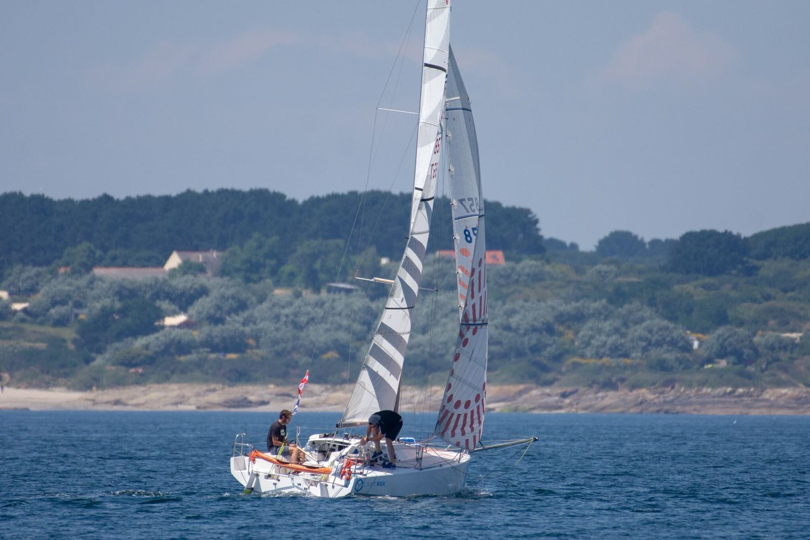

## What I will be up to in 2019

Starting in January, I will be training in France to race in the Mini-Transat! If you want to lear more about the race read through!

### The Race

The Mini-Transat is a biennial singlehanded transatlantic sailing race starting from La Rochelle, France and ending in Le Marin, Martinique, with a stop in the Canary Island. It is sailed on Minis 6.50, the smallest offshore racing yachts, and covers a total of 4,000 nm (nautical miles). Besides the size of the sailboat, the specificity is that competitors have no contact with the shore. The only means of communication authorized is VHF radio for boat-to-boat transmission, and a daily weather forecast broadcasted through SSB radio.

### The Qualification Process

The transatlantic race is the last event of the Classe Mini circuit, which comprises races of varying lengths (from 115 to 600 nm) throughout the year. In order to qualify for the Mini-Transat, competitors must complete a 1,000 nm solo predefined course to prove their solo sailing ability, along with a total of 1,500 nm raced in the Mini circuit. The limited number of 84 entry spots means that there is a long waitlist for every edition, not all qualified sailors can enter the race. The spots are attributed on a seniority basis: the first person to complete both the qualifications gets in the race first.

### Derogation for Foreign Sailors

The two years between each edition allow sailors to meet the qualification requirements during the first year and to continue to train during the second year. Thankfully, competitors who live outside of Europe can apply for a derogation (6 available for each edition). If accepted, a spot is held, letting them time to qualify in a single year without worrying about waitlist.

### The Boats
The ranking is divided into two categories of boats: series and prototypes. Series boats have very strict design rules focused on reducing the production and maintenance costs in an effort to make racing accessible. They are comparable to one-design classes. Prototypes boat have more conception freedom: they are typically built from lighter materials like carbon fiber, have more powerful rigs and a deeper draft. The common denominator between the two categories is the length of the boat: 6.5 meters, or 21 feet.

### The People

The profile of the Mini sailors varies widely. There is a mix of passionate amateurs realizing a lifelong dream and of professional sailors showcasing their skills to move on to bigger boats. A large part of the French sailing elite has raced in Minis: 25% of the skippers at the start of the 2018 Route du Rhum, the “Olympics” of singlehanded offshore sailing, raced in the Mini circuit.

### Further Readings on the Transat

[Wikipedia](https://en.wikipedia.org/wiki/Mini_Transat_6.50)
[Classe Mini Website](https://www.classemini.com/?mode=presentation)

### Next steps

After applying for a derogation and getting a positive reply, I decided to take a year off to train in Lorient, France and attempt to qualify for the 2019 Mini-Transat. This project is big challenge and being on the starting line would already be an accomplishment.
The tentative calendar for the upcoming year:
January/February/March: Training with Lorient Grand Large, attending electronics, meteorology, nutrition and sleep management courses 
**April 14th**: Plastimo Lorient Mini, 115 nm\
**April 25th**: Pornichet Select, 300 nm
**May 7th**: Mini en Mai, 500 nm
**June 6th**: Trophée MAP, 220 nm
**June 16th**: Mini Fastnet, 600 nm
**End of June, July**: 1000 nm solo qualification
**July 24th**: Transgascogne, 600 nm

#### A few pictures of my boat!

